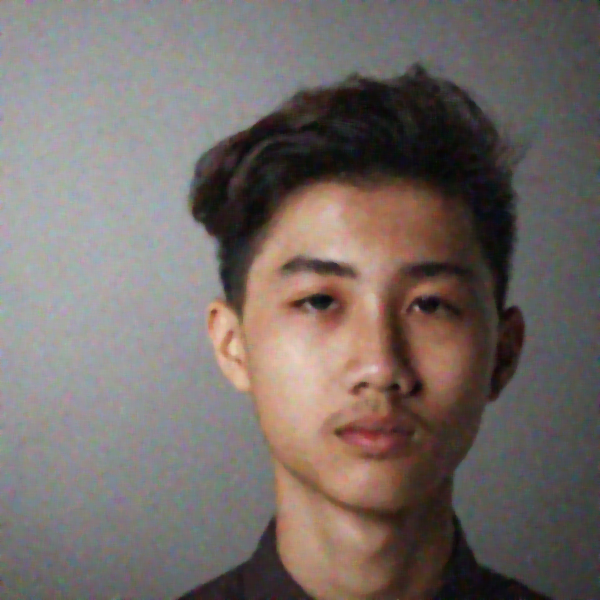
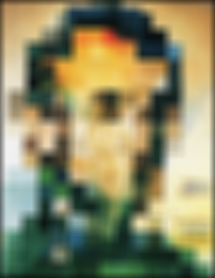
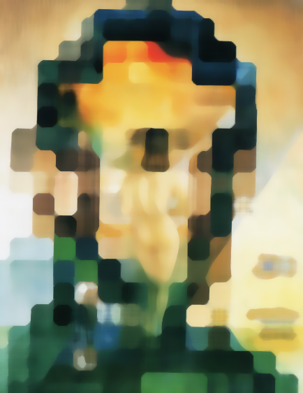

# Filtro Blur
1. Removendo Ruídos de uma Imagem

Noise Image          |  Box Filter (7x7) | Gaussian Filter(7x7) | Median Filter(7x7)
:-------------------------:|:-------------------------:|:-------------------------:|:-------------------------:
   |   |  |

2.Desfocando a Imagem

Noise Image          |  Box Filter (7x7) | Gaussian Filter(7x7) | Median Filter(7x7)
:-------------------------:|:-------------------------:|:-------------------------:|:-------------------------:
   |   |  |
