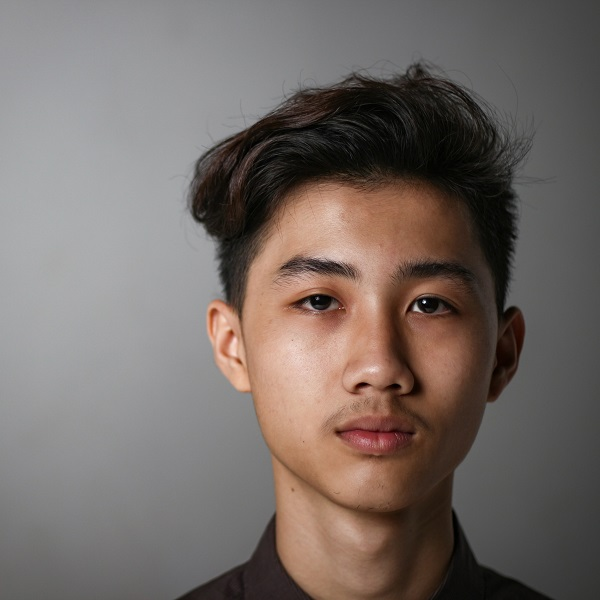

# Realçando uma Imagem (Sharpening)

Para realçar a imagem devemos recordar que a operação de **Blur** retira as altas frequencias de uma imagem, ou seja, após esta operação teremos uma imagem com frequencias mais baixas.

### Resultados:

Imagem Original          |  Box Filter (7x7) | Gaussian Filter(7x7) | Median Filter(7x7)
:-------------------------:|:-------------------------:|:-------------------------:|:-------------------------:
   |   |  |

