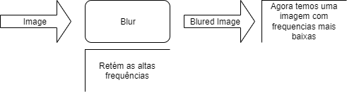

# Realçando uma Imagem (Sharpening)

Para realçar a imagem devemos recordar que a operação de **Blur** retira as altas frequências de uma imagem, ou seja, após esta operação teremos uma imagem com frequências mais baixas.

A seguir mostramos a matemática envolvida no processo de **_realce da imagem_** .
* **_I_** - imagem original
* **_I b_** - imagem blured: contém as baixas frequencias da imagem original

Portanto 
$$
m=I-I_b \text{ (imagem com as altas frequencias da imagem original)}
$$
Deste modo, tomando atenuamos nossa imagem aplicando um fator $$k \in \mathbb{R}$$ e criamos a imagem $$ H $$ 
$$
H=I+km
$$ 
Observe que agora $$H$$ trata-se de uma imagem 
$$
H=I+k(I-I_b)
$$ 

### Resultados:

Imagem Original          |  Box Filter (5x5) $$\sigma{5.5.}$$ | Gaussian Filter(7x7) | Median Filter(7x7)
:-------------------------:|:-------------------------:|:-------------------------:|:-------------------------:
   |   |  |

